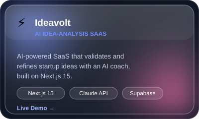
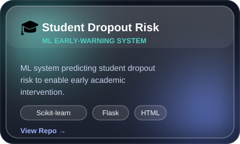
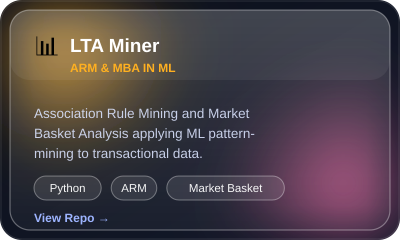
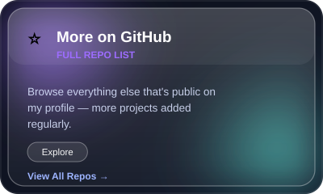

<h1 align="center">Hi 👋, I'm Vaishnav J</h1>
<h3 align="center">Data Science & AI/ML Developer | Web scraping  | Building things end-to-end</h3>

  

  
  
  

---

### 🚀 About Me

- 🎓 BCA graduate  based in Kerala, India
- 🔭 Currently building AI-powered full-stack projects — from EdTech platforms to desktop AI companions
- 🌱 Deep into multi-provider AI orchestration (Groq, Claude, Hugging Face, OpenRouter, NVIDIA NIM)
- 💼 Actively looking for entry-level Data Science / ML roles
- ⚡ Fun fact: I've built two different SSH-terminal portfolios (because one wasn't enough)

---

### 🛠️ Tech Stack

  

**AI / ML:** TensorFlow · Keras · Scikit-learn · Groq · Claude API · Hugging Face · OpenRouter · NVIDIA NIM
**Frontend:** React · TypeScript · TailwindCSS · Framer Motion · Vite
**Backend:** Node.js · Flask · FastAPI · Supabase
**Other:** Docker-ready deployments · Fly.io · Render · SSH/TUI apps

---

### 🧩 Featured Projects

<table>
<tr>
<td width="50%">

</td>
<td width="50%">

</td>
</tr>
<tr>
<td width="50%">

</td>
<td width="50%">

</td>
</tr>
</table>

🚧 <b>Currently Building (not yet public)</b> — click to expand

 

| Project | Description | Stack |
|---|---|---|
| 🏴‍☠️ **Nakama** | One Piece–themed AI desktop companion with all nine Straw Hats as distinct AI personalities, voice I/O, and animated visuals | Tauri 2 · React · TypeScript · Groq API |
| 📧 **Email Analyzer** | Full-stack Gmail inbox analyzer with multi-provider AI rotation for resilient inference | FastAPI · React · Gmail OAuth2 |
| 🕋 **Lisan Al-Dhad** | Arabic EdTech platform with comprehension, poetry-meter analysis, and a voice-quest game module | Flask · Sentence-Transformers · Whisper · Gradio |
| 💻 **Termfolio** | SaaS portfolio builder generating both a web UI and an interactive SSH terminal | React · Node.js · Supabase · ssh2 |
| 🖥️ **SSH Portfolio** | A personal portfolio you can `ssh` into — six themes, live clock, typewriter effects | Node.js · TypeScript · ssh2 · Fly.io |
| 🌐 **Portfolio Site** | Personal site with particle canvas animation and 3D-tilt project cards | React · Vite · Framer Motion |

*Repos going public soon — check back!*

---

### 📊 GitHub Stats

  
  

  

---

<i>⭐️ Open to Data Science / AI-ML opportunities — let's connect!</i>

